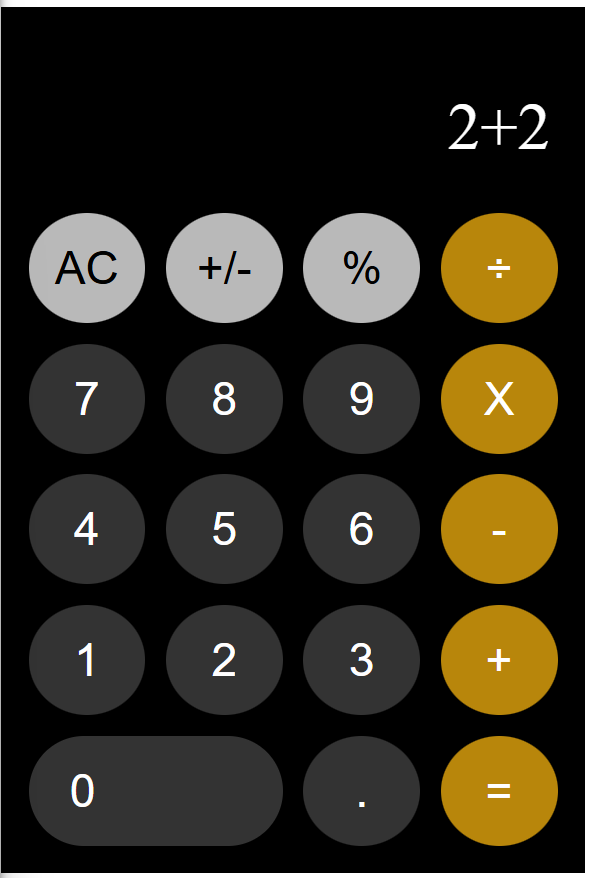

# CALCULATOR UI
This is a small basic project made for IE web team recs using only HTML and CSS.
## Features
- Whenever a button is pressed or it is in active mode it changes color.
## USED LANGUAGES
- HTML
- CSS
## SCREENSHOT
